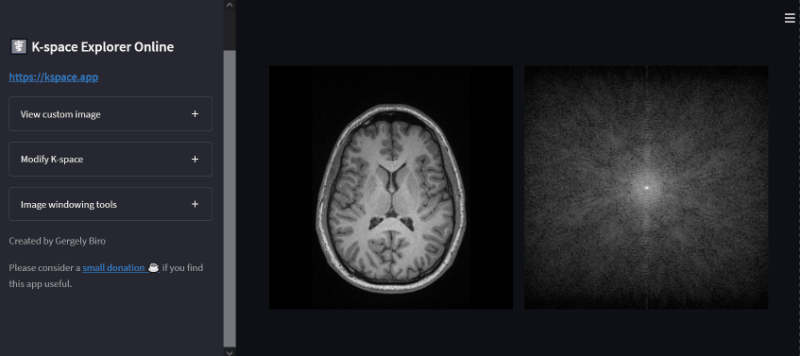

# K-space Explorer Online

**An educational tool to get hands-on experience with the k-space and the
effects of various modifications on the resulting image after an inverse
Fourier transform.**

**[Follow this link to run the online version (hosted on Streamlit cloud)](https://kspace-explorer.streamlitapp.com/)**



**K-space Explorer Online** is the experimental browser based version of 
[K-space Explorer](https://github.com/birogeri/kspace-explorer). The online 
version does not require any installation, and it can be used on any device 
capable of running a modern browser.

The software has many useful features, such as:

* A modern responsive user interface using Streamlit
* Automatic Fourier transform to instantaneously visualise changes
* Load your own images and analyse artefacts originating from k-space

Due to the differences in user interface capability, K-space Online does not 
have all the tools and features of the desktop version.

---

☕ **This app was created in my spare time.**
If you find it useful please consider [buying me a coffee with PayPal](https://www.paypal.me/birogeri/5gbp) ☕

---

## **Contents**
* [Installation](#installation)
* [Starting the program](#starting-the-program)
* [Disclaimer and limitations](#disclaimer-and-limitations)


## **Installation**

To try the online version of K-space Explorer, you do not need to install anything.
[There is a hosted version on Streamlit Cloud.](https://share.streamlit.io/birogeri/kspace-explorer-streamlit/kspace.py)
---

If you would like to install and run or host it on your own computer, follow the steps below

1. You will need to have the following software and packages

    * **Python 3** (ideally the latest version). Download from the [Python 3 homepage](https://www.python.org/downloads).

2. Required Packages for Python 3:

    * **Streamlit** - runs the code and displays the app
    * **Pillow**    - opens regular images such as jpg or png
    * **NumPy**     - handles FFT transforms and array operations
    * **pydicom**   - DICOM format medical image reader

    Install via pip by copying the command below to a command prompt (Windows: `Win+R` and type `cmd` and press Enter)

    ```shell
        pip3 install numpy pydicom Pillow streamlit
    ```

3. [Download the app](https://github.com/birogeri/kspace-explorer-streamlit/archive/master.zip) and extract it

## Starting the program

Navigate to the folder that contains the extracted software and run it by typing the command below

``` shell
    python -m streamlit run kspace.py
```

More info about Streamlit can be found [here.](https://docs.streamlit.io/)

## Disclaimer and limitations

This software is not intended for medical use.
Even if a scanner original DICOM file is used, the resulting k-space is not equivalent
to the scanner raw data as it contains all post-acquisition modifications
applied by the scanner software.

## Author & Contributors

|  |
|:--:|
| [Gergely Biró](https://www.linkedin.com/in/gergelybiro) |

